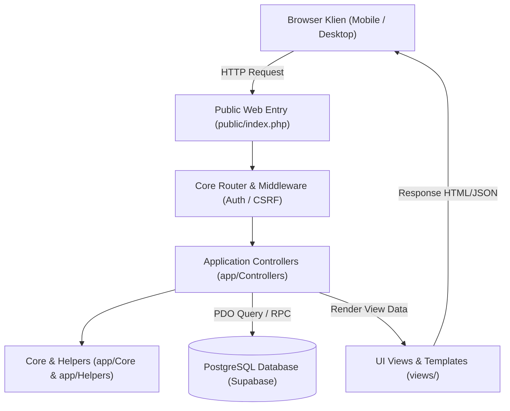

# KEREN SNACK ERP — System Architecture & Module Reference Manual

Dokumen ini merupakan spesifikasi teknis dan panduan arsitektur sistem resmi untuk **KEREN SNACK ERP**. Dokumen ini dirancang sebagai *Single Source of Truth* bagi pengembang sistem, arsitek perangkat lunak, dan agen AI untuk memahami struktur modular, alur data, pengendali (*controller*), antarmuka (*view*), relasi basis data (*database*), serta matriks hak akses peran (*RBAC*).

---

## 1. 🏗️ Gambaran Umum & Stack Teknologi



### Spesifikasi Teknologi:
- **Backend Core:** PHP 8.1+ Native (Vanilla MVC Pattern — Ringan, Cepat, Zero Framework Overhead).
- **Database Engine:** PostgreSQL 15+ (Hosted on Supabase Database Platform dengan Stored Procedures / RPC & Triggers Atomik).
- **Frontend Layer:** Server-Side Rendered (SSR) PHP Views + Alpine.js (Reactivity Lapangan) + Lucide Icons (Local Vendor Asset).
- **Design System:** Supabase Enterprise Minimalist Design System (Antigravity Carbon Dark / Slate Modern Light Theme).
- **Architecture Standard:** Modular MVC (Model-View-Controller) dengan Pemisahan Tanggung Jawab (*Separation of Concerns*).

---

## 2. 🌳 Struktur Direktori & Tanggung Jawab Folder

```text
kerensnack-erp/
├── app/                          # 🧠 Logika Aplikasi & Pengendali Bisnis
│   ├── Controllers/              # 🕹️ Controllers (Menangani Request, Validasi & Alur Bisnis)
│   ├── Core/                     # ⚙️ Komponen Inti (Auth, Router, Controller Base, Session)
│   └── Helpers/                  # 🛠️ Utilitas Tambahan (Format Rupiah/Tanggal, CSRF, ActivityLog)
│
├── config/                       # 🔌 Konfigurasi Sistem & Koneksi Basis Data
│   └── database.php              # Singleton PDO Connection ke PostgreSQL
│
├── database/                     # 🗄️ Berkas Skema SQL, Trigger, RPC & Migrasi
│   ├── 01_schema.sql             # Definisi 42 Tabel Master, Transaksi & Foreign Keys
│   ├── 02_triggers_and_rpc.sql   # Stored Procedures (fn_proses_kunjungan_konsinyasi, dll)
│   ├── 03_migration_konsinyasi.sql # Migrasi Khusus Modul Konsinyasi & Status
│   └── seeds/                    # Berkas Data Awal (Master Produk, Harga, Wilayah)
│
├── docs/                         # 📚 Dokumentasi PRD, Desain & Arsitektur
│   ├── ARCHITECTURE.md           # Dokumen Peta Arsitektur Sistem (File ini)
│   ├── PRD_MASTER_KEREN_SNACK.md # PRD Master Keseluruhan Modul ERP
│   └── PRD-Konsinyasi-PENYEMPURNAAN.md # PRD Modul Konsinyasi & Mobile Sales
│
├── public/                       # 🌐 Direktori Akses Publik Web Server
│   ├── assets/                   # Aset Statis (CSS, JS, Fonts, Favicon)
│   │   ├── css/app.css           # Global Stylesheet & Design Tokens
│   │   ├── js/app.js             # Global Engine, Theme & Sidebar Controller
│   │   ├── js/alpine.min.js      # Alpine.js Engine (Offline-First)
│   │   └── js/lucide.min.js      # Lucide Icon Library (Offline-First)
│   └── index.php                 # Front Controller / Entry Point Request Web
│
└── views/                        # 🎨 Antarmuka Tampilan Pengguna (Views)
    ├── auth/                     # Layar Login & Sesi
    ├── cash/                     # Layar Buku Kas, Transaksi & Laporan Arus Kas
    ├── consignment/              # Layar Konsinyasi Admin (B1-B5)
    │   └── sales/                # Layar Konsinyasi Mobile Sales (A1-A4)
    ├── customer_orders/          # Layar Faktur Penjualan B2B & Kasir Grosir
    ├── customers/                # Layar Master Toko Pelanggan & Wilayah
    ├── deliveries/               # Layar Logistik, Surat Jalan & Driver Mobile
    ├── employees/                # Layar Master Karyawan & Skema Remunerasi
    ├── inventory/                # Layar Stok Fisik Gudang & Kartu Stok
    ├── layouts/                  # Layout Induk (Header, Sidebar, Shell, Flash Toast)
    ├── owner/                    # Layar Owner Command Center (C1-C6)
    ├── pos/                      # Layar Kasir POS Retail Cepat
    ├── pricing/                  # Layar Matriks 28 Level Harga Produk
    ├── products/                 # Layar Master Produk, Bahan Baku & Resep BOM
    ├── profile/                  # Layar Pengaturan Akun & Profil Pengguna
    ├── purchases/                # Layar Pembelian Bahan ke Pemasok (PO Vendor)
    └── suppliers/                # Layar Master Pemasok / Vendor
```

---

## 3. 🗺️ Katalog Modul & Peta Navigasi Lengkap (Sitemap)

Tabel berikut adalah panduan pemetaan modul satu pintu: **URL Route $\leftrightarrow$ Controller $\leftrightarrow$ View $\leftrightarrow$ Tabel Database $\leftrightarrow$ Hak Akses Role**.

| Modul & Nama Fitur | URL Endpoint | Controller & Method | File View | Tabel Utama Terkait | Hak Akses (Role) |
| :--- | :--- | :--- | :--- | :--- | :--- |
| **Autentikasi & Login** | `GET /login`<br>`POST /login`<br>`GET /logout` | `AuthController::showLogin()`<br>`AuthController::login()`<br>`AuthController::logout()` | `views/auth/login.php` | `pengguna`, `peran`, `karyawan` | Semua Pengguna |
| **Kasir POS (Retail)** | `GET /pos`<br>`POST /pos/checkout` | `PosController::index()`<br>`PosController::checkout()` | `views/pos/index.php` | `pesanan`, `item_pesanan`, `item`, `akun_kas`, `arus_kas` | Owner, Admin |
| **Pesanan B2B / Grosir** | `GET /customer-orders`<br>`POST /customer-orders/store` | `CustomerOrderController::index()`<br>`CustomerOrderController::store()` | `views/customer_orders/index.php` | `pesanan`, `pelanggan`, `item_pesanan`, `surat_jalan` | Owner, Admin |
| **Konsinyasi Admin (B1-B5)** | `GET /consignment`<br>`POST /consignment/assign-driver`<br>`POST /consignment/pay-invoice` | `ConsignmentController::index()`<br>`ConsignmentController::assignDriver()`<br>`ConsignmentController::payInvoice()` | `views/consignment/index.php` | `stok_konsinyasi_toko`, `pelanggan`, `pesanan`, `kunjungan_konsinyasi`, `surat_jalan` | Owner, Admin |
| **Sales Mobile (A1)** | `GET /consignment/sales` | `ConsignmentController::salesIndex()` | `views/consignment/sales/index.php` | `pelanggan`, `stok_konsinyasi_toko`, `surat_jalan`, `karyawan` | Sales, Admin, Owner |
| **Opname Rak Sales (A2)** | `GET /consignment/sales/opname`<br>`POST /consignment/sales/process-opname` | `ConsignmentController::salesOpname()`<br>`ConsignmentController::processSalesOpname()` | `views/consignment/sales/opname.php` | `stok_konsinyasi_toko`, `kunjungan_konsinyasi`, `rincian_kunjungan_konsinyasi`, `pesanan` | Sales, Admin, Owner |
| **Nota Kunjungan (A3)** | `GET /consignment/sales/summary` | `ConsignmentController::salesSummary()` | `views/consignment/sales/summary.php` | `kunjungan_konsinyasi`, `rincian_kunjungan_konsinyasi`, `pesanan` | Sales, Admin, Owner |
| **Pengajuan Titip (A4)** | `GET /consignment/sales/request-delivery`<br>`POST /consignment/sales/submit-delivery` | `ConsignmentController::salesRequestDelivery()`<br>`ConsignmentController::submitSalesDelivery()` | `views/consignment/sales/delivery.php` | `pesanan`, `surat_jalan`, `item_pesanan`, `item` | Sales, Admin, Owner |
| **Logistik & Driver Mobile** | `GET /deliveries`<br>`POST /deliveries/update-status` | `DeliveryController::index()`<br>`DeliveryController::updateStatus()` | `views/deliveries/index.php` | `surat_jalan`, `pesanan`, `pelanggan`, `karyawan` | Driver, Sales, Admin, Owner |
| **Owner Dashboard (C1-C6)** | `GET /owner`<br>`POST /owner/consignment/approve-delivery`<br>`POST /owner/consignment/reject-delivery` | `OwnerController::index()`<br>`OwnerController::approveConsignmentDelivery()`<br>`OwnerController::rejectConsignmentDelivery()` | `views/owner/index.php` | `pesanan`, `surat_jalan`, `kunjungan_konsinyasi`, `rincian_kunjungan_konsinyasi`, `karyawan` | Owner |
| **Keuangan & Buku Kas** | `GET /cash`<br>`GET /cash/transactions`<br>`GET /cash/reports` | `CashController::index()`<br>`CashController::transactions()`<br>`CashController::reports()` | `views/cash/index.php`<br>`views/cash/transactions.php`<br>`views/cash/reports.php` | `akun_kas`, `arus_kas`, `kategori_arus_kas` | Owner, Admin |
| **Stok Fisik & Gudang** | `GET /inventory` | `InventoryController::index()` | `views/inventory/index.php` | `item`, `riwayat_stok`, `kategori_item` | Owner, Admin, Mandor |
| **Master Produk & BOM** | `GET /products`<br>`POST /products/store` | `ProductController::index()`<br>`ProductController::store()` | `views/products/index.php` | `item`, `resep_bom`, `satuan_barang` | Owner, Admin |
| **Matriks Level Harga** | `GET /pricing`<br>`POST /pricing/update` | `PricingController::index()`<br>`PricingController::update()` | `views/pricing/index.php` | `harga_khusus_pelanggan`, `level_harga`, `item` | Owner, Admin |
| **Master Toko & Pelanggan** | `GET /customers`<br>`POST /customers/store` | `CustomerController::index()`<br>`CustomerController::store()` | `views/customers/index.php` | `pelanggan`, `wilayah`, `karyawan` | Owner, Admin |
| **Master Pemasok Vendor** | `GET /suppliers`<br>`POST /suppliers/store` | `SupplierController::index()`<br>`SupplierController::store()` | `views/suppliers/index.php` | `pemasok` | Owner, Admin |
| **Master Data Karyawan** | `GET /employees`<br>`POST /employees/store` | `EmployeeController::index()`<br>`EmployeeController::store()` | `views/employees/index.php` | `karyawan`, `tabungan`, `kasbon` | Owner, Admin |
| **Pembelian Vendor (PO)** | `GET /purchases`<br>`POST /purchases/store` | `PurchaseController::index()`<br>`PurchaseController::store()` | `views/purchases/index.php` | `pembelian`, `item_pembelian`, `pemasok` | Owner, Admin |
| **Profil & Ganti Sandi** | `GET /profile`<br>`POST /profile/update-password` | `ProfileController::index()`<br>`ProfileController::updatePassword()` | `views/profile/index.php` | `pengguna` | Semua Pengguna |
| **Developer & AI Blueprint Portal** | `GET /developer/architecture` | `DeveloperController::architecture()` | `views/developer/architecture.php` | 42 Tabel Publik PostgreSQL Supabase & Stored Procedures | Developer, Owner |

---

## 4. 🗄️ Relasi Basis Data & Otomasi Stored Procedure (RPC)

### A. Tabel Kunci:
1. `public.pelanggan` — Menyimpan data toko mitra konsinyasi (`is_konsinyasi = TRUE`) dan relasi penanggung jawab sales tetap (`sales_driver_id` $\rightarrow$ `karyawan.id`).
2. `public.stok_konsinyasi_toko` — Menyimpan saldo kuantitas snack yang saat ini sedang dititipkan di rak masing-masing toko mitra per varian SKU.
3. `public.kunjungan_konsinyasi` & `public.rincian_kunjungan_konsinyasi` — Rekam audit kunjungan fisik sales, kuantitas sisa rak, barang laku, retur bagus, retur rusak, serta valuasi kerugian HPP rusak.
4. `public.surat_jalan` & `public.pesanan` — Berkas legal pengiriman dan faktur piutang. Tagihan riil ditandai dengan `adalah_tagihan = TRUE`.
5. `public.karyawan` — Master data personil dengan klasifikasi posisi (`sales`, `driver`, `pengemasan`, `mandor`, `admin`) dan konfigurasi komisi (`persentase_komisi_sales`).
6. `public.akun_kas` & `public.arus_kas` — Pencatatan saldo uang kasir/bank dan jurnal arus kas masuk/keluar otomatis.

### B. Otomasi Stored Procedures (RPC Engine):
* **`fn_proses_kunjungan_konsinyasi(...)`**:
  Memproses kunjungan opname sales di toko, menghitung laku terjual secara otomatis, mencatat kerugian HPP barang rusak, memperbarui saldo rak toko, mengembalikan barang retur bagus ke gudang pusat, serta menerbitkan faktur piutang riil (`adalah_tagihan = TRUE`).
* **`fn_catat_pembayaran_konsinyasi(...)`**:
  Mencatat pelunasan bertahap (*partial*) maupun lunas penuh atas faktur konsinyasi toko, menambah saldo kas/bank tujuan, dan mencatat transaksi di buku arus kas.
* **`trg_proses_pengiriman_konsinyasi`**:
  Trigger otomatis yang memotong stok fisik gudang pusat dan menambah saldo rak toko mitra saat surat jalan pengiriman berstatus `'selesai_diterima'`.

---

## 5. 👥 Matriks Hak Akses Peran (*RBAC*)

| Hak Akses / Kemampuan | 👑 Owner | 👩‍💼 Admin | 💼 Sales | 🚚 Driver | 👷 Mandor |
| :--- | :---: | :---: | :---: | :---: | :---: |
| **Akses Executive Dashboard (C1-C6)** | ✅ | ❌ | ❌ | ❌ | ❌ |
| **Gatekeeper Approval Pengiriman (C2)** | ✅ | ❌ | ❌ | ❌ | ❌ |
| **Kelola Master Data & Level Harga** | ✅ | ✅ | ❌ | ❌ | ❌ |
| **Kasir POS & Pesanan B2B** | ✅ | ✅ | ❌ | ❌ | ❌ |
| **Portal Konsinyasi Rak Admin (B1-B5)** | ✅ | ✅ | ❌ | ❌ | ❌ |
| **Sales Mobile Toko Binaan (A1-A4)** | ✅ | ✅ | ✅ | ❌ | ❌ |
| **Hitung & Lihat Komisi Penjualan** | ✅ | ❌ | ✅ | ❌ | ❌ |
| **Tugas Antar Surat Jalan (/deliveries)** | ✅ | ✅ | ✅ *(Opsional)* | ✅ *(Utama)* | ❌ |
| **Buku Kas & Jurnal Keuangan** | ✅ | ✅ | ❌ | ❌ | ❌ |
| **Stok Gudang & Produksi Packing** | ✅ | ✅ | ❌ | ❌ | ✅ |

---

## 6. 🔒 Standar Keamanan & Kode Etik Pengembangan

1. **CSRF Token:** Seluruh form POST wajib menyertakan `\App\Helpers\CSRF::field()` dan divalidasi dengan `$this->validateCsrf()`.
2. **Kerahasiaan Harga Lapangan:** Layar kurir Driver dan formulir pengajuan drop barang sales tidak membocorkan harga HPP maupun keuntungan perusahaan.
3. **Audit Log:** Seluruh mutasi kritis (keuangan, status pengiriman, perubahan harga) otomatis tercatat pada tabel `log_aktivitas`.
4. **Offline Resilience:** Antarmuka mobile didukung penyimpanan formulir sesi lokal untuk mencegah kehilangan input saat gangguan sinyal.

---
*Dokumentasi Arsitektur Resmi — KEREN SNACK ERP System.*
